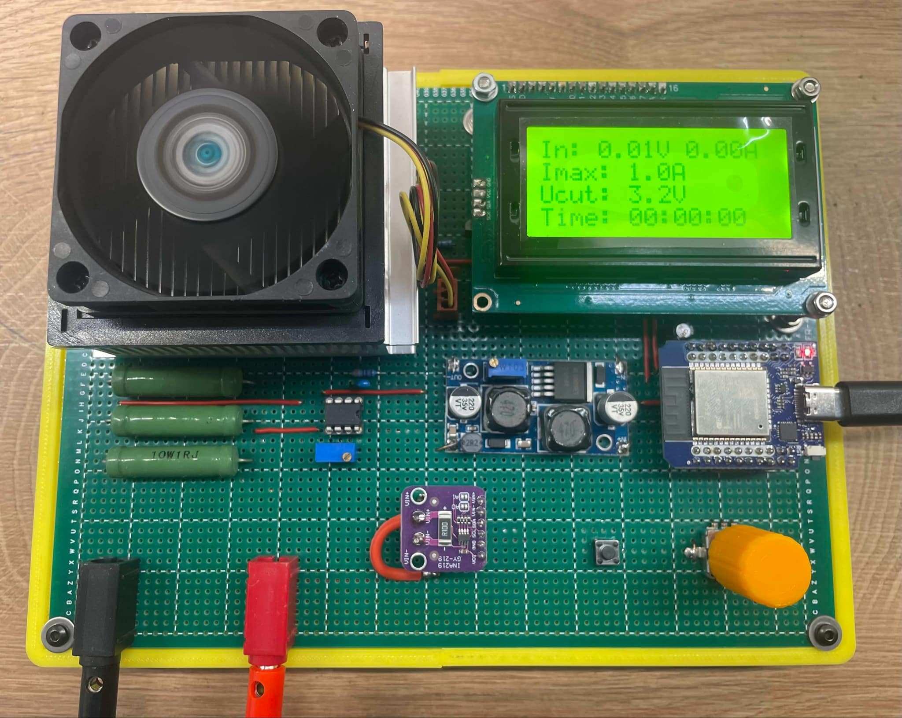
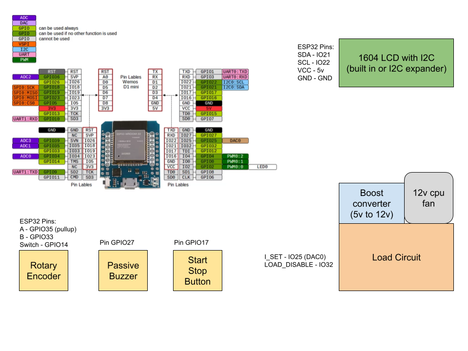

# battery-capacity-tester
Electronic dummy load and capacity tester built around an ESP32 arduino.

## Parts list
* Arduino ESP32
* 1604 LCD display with I2C (built-in or expansion board)
* INA219 current sensing module
* DC-DC Boost module (5v to 10-12V)
* Old CPU cooler with fan
* Rotary encoder with switch
* buzzer (optional)
* Power resistors (1 ohm 10W or similar)
* Small parts
  * IRF540 Mosfets x2
  * BC337 x1
  * LM358 x1
  * Small resistors and caps, trimmer pot, pcb button
  * Banana connectors, etc.

### ESP32 Connections

### Dummy load schematic

